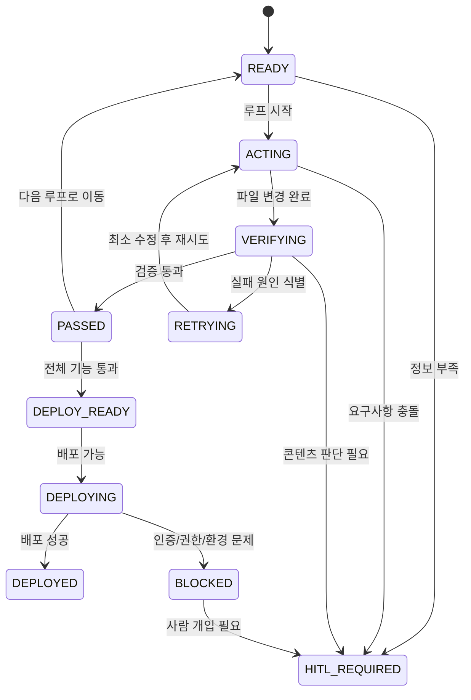

# AORR 상태 머신 설계: 개인 프로페셔널 웹사이트

이 문서는 GitHub Pages에서 실행 가능한 정적 개인 프로페셔널 웹사이트를 만들기 위한 실행 계획이다.

대상 저장소는 `520alsdud520-ops/520alsdud520-ops.github.io.git` 이다.

최종 산출물은 HTML, CSS, JavaScript만으로 동작해야 하며, 루트 디렉토리에 최소 다음 파일이 존재해야 한다.

- `index.html`
- `styles.css`
- `script.js`
- 게임 구현에 필요한 JavaScript 파일 또는 `script.js` 내부 게임 코드

현재 설계는 코드 수정, 테스트 실행, 배포를 수행하지 않는다. 설계만 정의한다.

## 1. Target

### 프로페셔널 웹사이트 개발 목표

- 개인 소개를 깔끔하게 보여주는 정적 웹사이트를 만든다.
- 방문자가 한눈에 이해할 수 있는 정보 구조를 제공한다.
- 데스크톱과 모바일 모두에서 자연스럽게 동작해야 한다.
- 별도의 백엔드 없이 GitHub Pages에 배포 가능한 형태여야 한다.

### GitHub Pages 배포 목표

- 대상 저장소 `520alsdud520-ops/520alsdud520-ops.github.io.git` 에서 Pages 배포가 가능해야 한다.
- 저장소 루트 또는 Pages 설정에 맞는 정적 파일 배포가 가능해야 한다.
- 외부 런타임이나 서버 의존성이 없어야 한다.
- 상대 경로 및 정적 리소스만 사용해야 한다.
- 배포 후에도 경로 깨짐이 없어야 한다.

### 입력 자료

- 대상 저장소: `520alsdud520-ops/520alsdud520-ops.github.io.git`
- 이름, 직함, 소개 문구, 연락처 등 개인 콘텐츠
- 경력, 프로젝트, 활동 내역
- 프로필 이미지 또는 아이콘 자료 `[사람 확인 필요]`
- 색상, 분위기, 타이포그래피 선호 `[사람 확인 필요]`
- Games 탭의 이름과 배치 방식 `[사람 확인 필요]`
- 지렁이 게임의 규칙과 난이도 `[사람 확인 필요]`

### 필수 페이지와 섹션

- Home 또는 Hero
- About / Intro
- Projects
- Contact
- Games

추가 섹션은 필요에 따라 포함할 수 있으나, 첫 버전은 단순한 구조를 우선한다.

### Games 탭 및 지렁이 게임 요구사항

- `Games` 탭에서 지렁이 게임을 실행할 수 있어야 한다.
- 게임은 브라우저에서 동작해야 한다.
- 외부 서버 호출 없이 로컬 자바스크립트만으로 동작해야 한다.
- 키보드 조작을 지원해야 한다.
- 모바일 터치 조작을 지원해야 한다.
- 점수 또는 생존 길이 같은 진행 표시가 있어야 한다 `[사람 확인 필요]`.
- 게임오버와 재시작이 가능해야 한다.

### 데스크톱 및 모바일 완료 기준

- 데스크톱: 주요 브라우저에서 레이아웃이 무너지지 않아야 한다.
- 모바일: 작은 화면에서 가로 스크롤 없이 읽히고 조작 가능해야 한다.
- 내비게이션: 메뉴 항목이 터치하기에 충분히 커야 한다.
- 게임: 키보드와 터치 모두로 플레이 가능해야 한다.
- GitHub Pages: 빌드 과정 없이 정적 파일만으로 열려야 한다.

## 2. Act

### 한 번의 개발 루프에서 수행할 최소 작업

한 루프는 반드시 하나의 실패 원인만 다루며, 가능한 한 작은 범위의 파일만 수정한다.

예시 최소 작업 단위:

1. HTML 구조만 추가한다.
2. CSS 반응형 규칙만 추가한다.
3. 게임 입력만 추가한다.
4. 점수 또는 UI 한 조각만 추가한다.
5. 배포 호환성 점검만 한다.

### 수정 가능한 파일 범위

- `index.html`
- `styles.css`
- `script.js`
- 게임 전용 JS 파일 `[사람 확인 필요]`
- 정적 이미지, 아이콘, 텍스트 자산

### 생성할 수 있는 파일

- `index.html`
- `styles.css`
- `script.js`
- 필요 시 `game.js` 또는 `snake.js` 같은 게임 전용 JS 파일 `[사람 확인 필요]`
- 필요 시 정적 이미지 파일

### 실행 가능한 로컬 검증 명령어

검증은 로컬 정적 서버를 기준으로 생각한다.

- 파일 존재 확인
- HTML/JS/CSS 파일 로드 확인
- 로컬 서버에서 페이지 열기 확인
- 브라우저 콘솔 오류 확인
- 게임 입력 반응 확인
- 반응형 레이아웃 확인

권장 검증 항목의 예:

- `index.html` 접근 가능 여부
- 개발자 도구 콘솔 에러 여부
- 모바일 뷰포트에서 레이아웃 유지 여부
- 키보드 입력 반응 여부
- 터치 입력 반응 여부

실제 명령어는 구현 방식에 따라 달라질 수 있으므로, 구체 커맨드는 각 루프에서 결정한다 `[사람 확인 필요]`.

## 3. Observe

각 루프에서 다음 항목을 관찰한다.

- 파일 생성 여부
- HTML 오류
- CSS 반응형 오류
- JavaScript 실행 오류
- 게임 로직 오류
- 브라우저 콘솔 오류
- 로컬 웹서버 응답
- 데스크톱 화면
- 모바일 화면
- 키보드 조작
- 터치 조작
- GitHub Pages 호환성

관찰 결과는 실패 원인 분류에 사용한다.

## 4. Reason

실패 원인은 다음 중 하나로만 분류한다.

- `HTML_STRUCTURE`
- `CSS_RESPONSIVE`
- `JAVASCRIPT`
- `GAME_LOGIC`
- `GAME_CONTROL`
- `CONTENT`
- `TEST`
- `ENVIRONMENT`
- `GITHUB_PERMISSION`
- `DEPLOYMENT`
- `UNKNOWN`

### 분류 기준

- `HTML_STRUCTURE`: 태그 구조, 시맨틱, 누락된 요소, 잘못된 중첩
- `CSS_RESPONSIVE`: 레이아웃 깨짐, 미디어 쿼리 문제, 오버플로우
- `JAVASCRIPT`: 스크립트 로드 실패, 런타임 에러, 변수/함수 오류
- `GAME_LOGIC`: 충돌 판정, 점수 계산, 이동 규칙, 게임 상태 오류
- `GAME_CONTROL`: 키보드, 터치, 버튼 입력의 반응 이상
- `CONTENT`: 문구, 이름, 소개, 프로젝트 정보의 불명확함 또는 누락
- `TEST`: 검증 절차 자체가 불충분하거나 재현성이 낮음
- `ENVIRONMENT`: 로컬 서버, 브라우저, 파일 경로, 실행 환경 문제
- `GITHUB_PERMISSION`: 저장소 권한, 토큰, 인증, 푸시 권한 문제
- `DEPLOYMENT`: GitHub Pages 설정, 배포 반영, 경로 문제
- `UNKNOWN`: 원인 특정 불가

## 5. Repeat

반복 규칙은 다음과 같다.

- 한 번에 하나의 실패 원인만 수정한다.
- 관련된 최소 파일만 변경한다.
- 수정 후 동일한 verifier를 다시 실행한다.
- 이미 통과한 기능에 대해서는 회귀 테스트를 실행한다.
- 실패 원인이 바뀌면 새로운 루프로 간주한다.

### 회귀 테스트 원칙

- HTML 수정 후에는 레이아웃과 기본 렌더링을 다시 본다.
- CSS 수정 후에는 데스크톱과 모바일 둘 다 다시 본다.
- JavaScript 수정 후에는 콘솔 오류와 게임 입력을 다시 본다.
- 게임 수정 후에는 키보드, 터치, 종료/재시작 흐름을 다시 본다.

## 6. Stop

다음 중 하나면 해당 루프 또는 전체 작업을 중단한다.

- 전체 테스트가 통과한 경우
- 최대 Retry에 도달한 경우
- 동일한 오류 fingerprint가 2회 반복된 경우
- 개인정보나 콘텐츠 확인이 필요한 경우
- GitHub 인증 또는 배포 권한 문제가 발생한 경우

이때 필요한 경우 사람 확인 단계로 전환한다.

## 7. Human-in-the-loop

다음 상황에서는 사람 확인이 필요하다.

- 이름, 소개, 경력, 프로젝트 등 개인 콘텐츠가 불명확한 경우
- 기존 콘텐츠 삭제가 필요한 경우
- 외부 분석 도구나 외부 서비스를 추가해야 하는 경우
- GitHub 저장소 설정을 변경해야 하는 경우
- 요구사항이 충돌하는 경우
- 게임 규칙, 난이도, 조작 방식이 정해지지 않은 경우
- 시각 스타일이나 브랜드 톤이 정해지지 않은 경우

확실하지 않은 내용은 추측하지 않고 `[사람 확인 필요]`로 표시한다.

---

## 실행 가능한 AORR 상태 머신

### 상태 정의

- `READY`: 다음 루프를 시작할 준비가 된 상태
- `ACTING`: 파일을 수정하거나 추가하는 상태
- `VERIFYING`: 검증과 관찰을 수행하는 상태
- `RETRYING`: 실패 원인을 하나만 수정하고 다시 시도하는 상태
- `PASSED`: 현재 루프가 통과한 상태
- `DEPLOY_READY`: 배포 전 검증이 모두 통과한 상태
- `DEPLOYING`: GitHub Pages 배포를 진행하는 상태
- `DEPLOYED`: 배포가 완료된 상태
- `BLOCKED`: 환경 또는 권한 문제로 진행이 멈춘 상태
- `HITL_REQUIRED`: 사람 확인이 필요한 상태

### 상태 전이 규칙

---

## 개발 루프 테이블

### 루프 1. 저장소 및 기존 파일 확인

| 항목 | 내용 |
|---|---|
| 상태 | `READY` |
| 입력 | Git 저장소, 현재 파일 목록, README, 브랜치 상태 |
| Act | 저장소 구조와 기존 파일을 확인한다 |
| Observe | 루트 파일 존재 여부, 브랜치, 원격 저장소, 빈 프로젝트인지 여부를 본다 |
| 출력 | 현재 시작점과 제약을 정리한 기초 진단 |
| 테스트 기준 | 루트에 무엇이 있는지 설명 가능해야 한다 |
| 다음 상태 | `PASSED` 또는 `HITL_REQUIRED` |

### 루프 2. 정적 사이트 기본 구조

| 항목 | 내용 |
|---|---|
| 상태 | `READY` |
| 입력 | 사이트 목표, 필수 섹션, 정적 파일 구조 |
| Act | `index.html`, `styles.css`, `script.js`의 기본 골격을 만든다 |
| Observe | HTML 구조, 헤더/본문/푸터 배치, 기본 링크 동작을 본다 |
| 출력 | 렌더링 가능한 초기 사이트 골격 |
| 테스트 기준 | 페이지가 열리고 주요 섹션이 보인다 |
| 다음 상태 | `PASSED` 또는 `RETRYING` |

### 루프 3. 프로페셔널 콘텐츠 영역

| 항목 | 내용 |
|---|---|
| 상태 | `READY` |
| 입력 | 이름, 소개, 경력, 프로젝트, 연락처 `[사람 확인 필요]` |
| Act | 소개/프로젝트/연락처 영역에 실제 콘텐츠를 배치한다 |
| Observe | 문장 길이, 빈 공간, 가독성, 신뢰감 전달을 본다 |
| 출력 | 개인 프로필이 드러나는 콘텐츠 섹션 |
| 테스트 기준 | 핵심 자기소개와 프로젝트가 명확하게 읽힌다 |
| 다음 상태 | `PASSED` 또는 `HITL_REQUIRED` |

### 루프 4. 반응형 내비게이션

| 항목 | 내용 |
|---|---|
| 상태 | `READY` |
| 입력 | 메뉴 목록, 모바일 우선 기준 |
| Act | 데스크톱/모바일 내비게이션을 구현한다 |
| Observe | 작은 화면에서 메뉴가 겹치거나 잘리는지 본다 |
| 출력 | 반응형 메뉴 |
| 테스트 기준 | 모바일에서 탭하기 쉽고 데스크톱에서 자연스럽다 |
| 다음 상태 | `PASSED` 또는 `RETRYING` |

### 루프 5. Games 탭

| 항목 | 내용 |
|---|---|
| 상태 | `READY` |
| 입력 | Games 탭 이름, 진입 방식 `[사람 확인 필요]` |
| Act | 내비게이션에 Games 항목과 진입 경로를 추가한다 |
| Observe | 다른 섹션과의 동선, 진입 후 복귀 가능성을 본다 |
| 출력 | 게임으로 이동 가능한 메뉴 진입점 |
| 테스트 기준 | Games 탭 클릭 또는 탭으로 게임 화면에 도달한다 |
| 다음 상태 | `PASSED` 또는 `RETRYING` |

### 루프 6. 지렁이 게임 핵심 로직

| 항목 | 내용 |
|---|---|
| 상태 | `READY` |
| 입력 | 게임 규칙, 격자 크기, 점수 규칙 `[사람 확인 필요]` |
| Act | 지렁이 이동, 먹이 생성, 충돌, 성장, 게임오버를 구현한다 |
| Observe | 이동이 자연스러운지, 먹이와 충돌이 정상인지 본다 |
| 출력 | 플레이 가능한 핵심 게임 루프 |
| 테스트 기준 | 게임이 멈추지 않고 한 판이 끝까지 진행된다 |
| 다음 상태 | `PASSED` 또는 `RETRYING` |

### 루프 7. 키보드 조작

| 항목 | 내용 |
|---|---|
| 상태 | `READY` |
| 입력 | 방향키 또는 `WASD` 사용 여부 `[사람 확인 필요]` |
| Act | 키보드 입력으로 지렁이를 이동하게 한다 |
| Observe | 입력 지연, 반응성, 방향 전환 제한을 본다 |
| 출력 | 키보드 조작 가능 게임 |
| 테스트 기준 | 데스크톱에서 키보드만으로 플레이 가능하다 |
| 다음 상태 | `PASSED` 또는 `RETRYING` |

### 루프 8. 모바일 터치 조작

| 항목 | 내용 |
|---|---|
| 상태 | `READY` |
| 입력 | 스와이프, 버튼, 드래그 중 선택 `[사람 확인 필요]` |
| Act | 터치 입력으로 방향 전환 또는 이동을 연결한다 |
| Observe | 터치 반응성, 오작동, 손가락 가림을 본다 |
| 출력 | 모바일 조작 가능 게임 |
| 테스트 기준 | 모바일 화면에서 충분히 조작 가능하다 |
| 다음 상태 | `PASSED` 또는 `RETRYING` |

### 루프 9. 게임 UI 및 점수

| 항목 | 내용 |
|---|---|
| 상태 | `READY` |
| 입력 | 점수 표시 방식, 게임오버 문구 `[사람 확인 필요]` |
| Act | 점수, 상태 메시지, 재시작 버튼을 추가한다 |
| Observe | UI가 과밀하지 않은지, 흐름이 끊기지 않는지 본다 |
| 출력 | 완성도 있는 게임 화면 |
| 테스트 기준 | 점수와 재시작이 명확하게 보인다 |
| 다음 상태 | `PASSED` 또는 `RETRYING` |

### 루프 10. 접근성과 반응형 검증

| 항목 | 내용 |
|---|---|
| 상태 | `READY` |
| 입력 | 접근성 기준, 주요 뷰포트 |
| Act | 대비, 포커스, 텍스트 크기, 오버플로우를 점검한다 |
| Observe | 데스크톱과 모바일 화면 모두를 확인한다 |
| 출력 | 접근성과 반응형 보완 사항 목록 |
| 테스트 기준 | 화면이 깨지지 않고 기본 접근성이 확보된다 |
| 다음 상태 | `PASSED` 또는 `RETRYING` |

### 루프 11. GitHub Pages 호환성 검증

| 항목 | 내용 |
|---|---|
| 상태 | `READY` |
| 입력 | 루트 파일 배치, 정적 경로, Pages 제약 |
| Act | 빌드 없이 열리는지, 경로가 맞는지 확인한다 |
| Observe | 상대 경로, 외부 의존성, 스크립트 로드 여부를 본다 |
| 출력 | GitHub Pages 호환성 판정 |
| 테스트 기준 | 정적 파일만으로 동작해야 한다 |
| 다음 상태 | `PASSED`, `DEPLOY_READY`, 또는 `RETRYING` |

### 루프 12. 배포

| 항목 | 내용 |
|---|---|
| 상태 | `DEPLOY_READY` |
| 입력 | 검증 완료된 정적 파일, 배포 권한, 저장소 설정 |
| Act | GitHub Pages에 배포한다 |
| Observe | 배포 반영, URL 응답, 경로 깨짐 여부를 본다 |
| 출력 | 배포 완료 URL |
| 테스트 기준 | 운영 URL에서 사이트가 정상 표시된다 |
| 다음 상태 | `DEPLOYED` 또는 `BLOCKED` |

---

## 상태별 운영 규칙

### READY

- 다음 루프를 시작할 준비 상태다.
- 입력이 충분한지 먼저 확인한다.

### ACTING

- 파일을 변경하는 유일한 상태다.
- 한 번에 하나의 실패 원인만 다룬다.

### VERIFYING

- 변경 후 반드시 관찰과 검증을 수행한다.
- 버그가 새로 생겼는지 확인한다.

### RETRYING

- 실패 원인을 하나만 수정한다.
- 최소 파일만 건드린다.

### PASSED

- 해당 루프는 통과한 상태다.
- 다음 루프로 이동하거나 배포 준비로 간다.

### DEPLOY_READY

- 전체 핵심 기능과 호환성 검증이 끝난 상태다.

### DEPLOYING

- 배포 절차를 진행한다.

### DEPLOYED

- GitHub Pages에서 서비스가 보이는 상태다.

### BLOCKED

- 인증, 권한, 환경 문제로 더 진행할 수 없다.

### HITL_REQUIRED

- 사람의 결정이 필요하다.
- 콘텐츠, 요구사항, 배포 권한, 충돌 조건을 확인해야 한다.

---

## 권장 첫 루프

가장 안전한 첫 루프는 다음이다.

1. 저장소 및 기존 파일 확인
2. 정적 사이트 기본 구조
3. 프로페셔널 콘텐츠 영역

이 순서는 구조를 먼저 안정화하고, 그 다음 모바일 대응과 게임 기능으로 확장하기에 가장 안전하다.

## Step 1 게임 추가 기능 반영 여부

현재 작업 디렉토리에서 확인한 Step 1 결과에는 별도의 `[게임 추가 기능:]` 텍스트가 존재하지 않았다.  
따라서 본 설계에서는 지렁이 게임 요구사항만 반영했으며, 추가 게임 요구사항이 존재한다면 `[사람 확인 필요]`로 보완해야 한다.

---

## Self-Correcting TDD Loop

This section defines a Verifier-centered self-correcting TDD loop for the current static website project.

### Environment and available verifier tools

Confirmed in the current environment:

- `git.exe` is available
- `python.exe` is available
- `node.exe` is available
- `npm.cmd` is available
- `claude.cmd` is available

Confirmed about Claude Code CLI:

- CLI version: `2.1.172 (Claude Code)`
- `claude --help` is available
- `claude auth status` is not logged in right now
- `claude --print --model sonnet` returned `Not logged in · Please run /login`

Implication:

- Claude Code CLI can be designed as an independent verifier only after authentication is available.
- Until then, use local verifiers and browser-based checks available in the environment.
- Do not invent npm scripts or test commands that do not exist in the repository.

### Verifier hierarchy

Use verifiers in this order when they exist:

1. File existence and path verifier
2. HTML structure verifier
3. CSS responsive verifier
4. JavaScript syntax and runtime verifier
5. Game interaction verifier
6. Local HTTP verifier
7. Browser viewport verifier
8. GitHub Pages compatibility verifier
9. Claude Code CLI verifier, only when authenticated

### Canonical local commands that exist in this environment

The loop may use these commands because they are present:

- `git status`
- `git diff`
- `python -m http.server`
- `node`
- `npm`
- `claude`

Use `python -m http.server` rather than `python3 -m http.server` because `python3.exe` is present but unreliable in this shell session.

### Self-Correcting TDD loop shape

Each retry cycle must follow this order:

1. Red
2. Verify
3. Diagnose
4. Patch
5. Re-verify
6. Regression check
7. Stop or repeat

### TDD loop by verifier

#### 1. Basic file verification

Goal:

- Confirm that the repository root contains the files needed for GitHub Pages.

Verifier checks:

- Root `index.html` exists
- `styles.css` exists and is referenced from `index.html`
- `script.js` exists and is referenced from `index.html`
- No incorrect local file paths are used
- No case-mismatched asset references are used
- No absolute local filesystem paths are used in deployable references

Suggested verifiers:

- `git status --short`
- `Get-ChildItem`
- `Select-String` or `rg` for asset references

Failure classification:

- `HTML_STRUCTURE`
- `ENVIRONMENT`
- `TEST`

#### 2. HTML verification

Goal:

- Confirm that the page structure is valid and semantically usable.

Verifier checks:

- Basic document structure is present
- `title` exists
- `meta viewport` exists
- Semantic tags are used where appropriate
- Navigation links exist and point to valid targets
- `Games` area exists
- Images include `alt` text
- Internal links are not broken

Suggested verifiers:

- HTML source scan
- Browser DOM inspection
- Anchor and ID target scan

Failure classification:

- `HTML_STRUCTURE`
- `CONTENT`

#### 3. CSS verification

Goal:

- Confirm the layout behaves across desktop, tablet, and mobile widths.

Verifier checks:

- Desktop viewport layout is stable
- Tablet viewport layout is stable
- Mobile viewport layout is stable
- No horizontal scrolling appears unexpectedly
- Navigation responds correctly on narrow screens
- Games UI remains usable in responsive layouts

Suggested verifiers:

- Browser viewport checks at approximately `375px`, `768px`, and `1440px`
- Screenshot comparison if available
- Manual resize inspection

Failure classification:

- `CSS_RESPONSIVE`
- `TEST`

#### 4. JavaScript verification

Goal:

- Confirm the site script loads and runs without runtime errors.

Verifier checks:

- Syntax errors are absent
- Browser console is clean
- No DOM `null` reference errors
- No duplicated event listeners on repeated entry into Games
- Page load does not throw errors

Suggested verifiers:

- Browser console inspection
- Script load check
- DOM hook audit

Failure classification:

- `JAVASCRIPT`
- `TEST`

#### 5. Snake game verification

Goal:

- Confirm the game works as a reusable module inside the static site.

Verifier checks:

- Game starts
- Game can be paused
- Game can be restarted
- Score increases
- Food spawns
- Wall collision ends the game
- Self-collision ends the game
- Keyboard arrow keys or WASD work
- Mobile button or touch control works
- Immediate reverse direction is prevented
- Reopening `Games` does not create duplicate game loops

Suggested verifiers:

- Browser playthrough
- Keyboard input test
- Touch input test
- Re-entry test for the Games view

Failure classification:

- `GAME_LOGIC`
- `GAME_CONTROL`
- `JAVASCRIPT`

#### 6. Local execution verification

Goal:

- Confirm the site can be served locally as static files.

Verifier checks:

- Local HTTP server responds
- `index.html` loads through HTTP
- CSS file is reachable
- JavaScript file is reachable

Suggested verifiers:

- `python -m http.server <port>`
- Browser load from `http://localhost:<port>/`

Failure classification:

- `ENVIRONMENT`
- `TEST`

#### 7. Browser verification

Goal:

- Confirm the page works in practical viewport sizes.

Verifier checks:

- Mobile viewport around `375px`
- Tablet viewport around `768px`
- Desktop viewport around `1440px`

Suggested verifiers:

- Browser resize
- Browser device emulation if available

Failure classification:

- `CSS_RESPONSIVE`
- `GAME_CONTROL`
- `TEST`

#### 8. GitHub Pages compatibility verification

Goal:

- Confirm the final site can run as a static GitHub Pages site.

Verifier checks:

- Root `index.html` is present
- Static relative paths are used
- No server-only features are used
- No local filesystem dependency is used
- No backend API dependency is used

Suggested verifiers:

- File scan
- Browser load from static server
- Reference audit for absolute paths

Failure classification:

- `DEPLOYMENT`
- `HTML_STRUCTURE`
- `ENVIRONMENT`

### Failure log schema

For every failure, record:

- Command executed
- Exit code
- Failed verification item
- Core error message
- Related file and line
- Browser console messages
- Error fingerprint

Recommended fingerprint fields:

- Verification stage
- Error category
- Core message
- File path
- Line number

### Retry policy

- Maximum 3 retries per unique error
- Fix only one root cause per retry
- Change only the minimum related files
- Do not weaken the tests
- Do not remove test coverage to make the build pass
- Do not rewrite the whole site unless the root cause is structural
- If the same fingerprint repeats twice, stop

### Repeat rules

On each retry:

1. State the hypothesis
2. State the files to change
3. State the command to re-run
4. Apply the smallest possible change
5. Re-run the same verifier
6. Run regression checks for previously passing features

### Stop rules

Stop the loop when:

- All required tests pass
- Retry limit is reached
- The same error fingerprint appears twice
- Content or privacy needs human review
- GitHub authentication or deployment permission is missing
- The environment cannot support the required verifier

### Human-in-the-loop triggers

Escalate to a person when:

- Personal name, bio, experience, or project content is unclear
- Existing content must be deleted
- An external analysis tool or external service must be added
- GitHub repository settings must change
- Requirements conflict
- Deployment requires credentials or permissions that are unavailable

### Recommended verifier-centered loop for this project

1. Detect the current files and current route structure
2. Verify basic HTML file presence and asset links
3. Verify semantic HTML and navigation
4. Verify responsive CSS across desktop, tablet, and mobile
5. Verify JavaScript syntax and runtime
6. Verify the snake game core loop
7. Verify keyboard control
8. Verify touch control
9. Verify game UI and score
10. Verify GitHub Pages compatibility
11. Verify local static HTTP serving
12. Deploy only after the `DEPLOY_READY` gate

### Notes on Claude Code CLI as an independent verifier

- Use Claude Code CLI only after authentication is available
- The current local Claude settings file shows the default model alias as `sonnet`
- If Sonnet 5 becomes available, record the exact model string before using it
- If Sonnet 5 is not available, use the currently available Sonnet model and record the exact model string
- Do not assume a model name that was not verified in the CLI
- If authentication remains unavailable, mark the Claude verifier path as `BLOCKED`
- If `claude --print` continues to time out in this environment, mark the model probe path as `BLOCKED` and fall back to local verifiers
